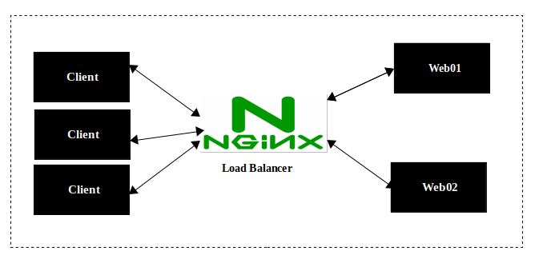

## What is Load balancing?

Load balancing is the practice of distributing computational workloads between two or more computers. On the Internet, load balancing is often employed to divide network traffic among several servers. This reduces the strain on each server and makes the servers more efficient, speeding up performance and reducing latency.

## How does load balancing work?

Load balancing is handled by a tool or application called a load balancer. When a request arrives from a user, the load balancer assigns the request to a given server, and this process repeats for each request. Load balancers determine which server should handle each requests. 


   - *Below is an illustration of a requests served without a load balancer. (there is an overload on one server, one server works well and the rest are idle.)*

.png)

   - *Below is an illustration with a load balancer (traffic is distributed between the servers)*

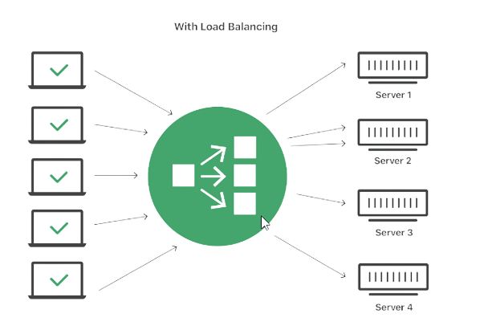


Now that we have a good understanding of what a load balancer is and how it works, let's create a load balancer and distribute traffic through it. We will be using Nginx as a load balancer,


## Setting Up a Basic Load Balancer


1. First we will provision two EC instances and install apache webserver in them. We will open port 8000 and allow traffic from anywhere.

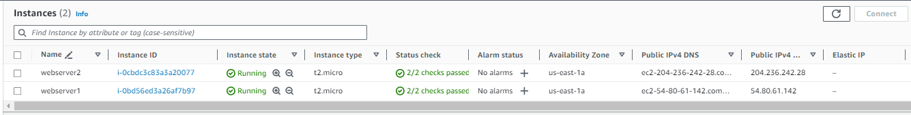


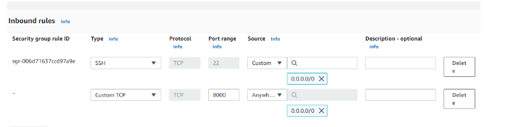


2. Run `sudo apt update -y && sudo apt install apache2 -y` to install Apache on both servers.

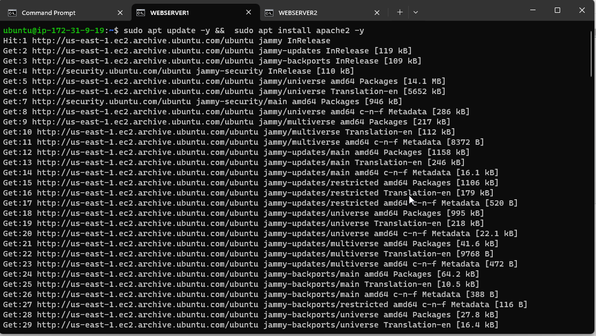

3. Run `sudo systemctl status apache2` to verify that Apache is running

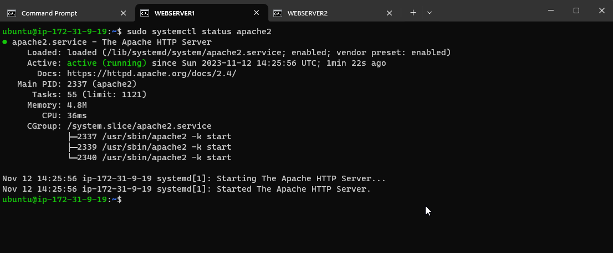

4. Run `sudo vi /etc/apache2/ports.conf` to configure Apache to serve content on port 8000 and add a new Listen directive for port 8000.

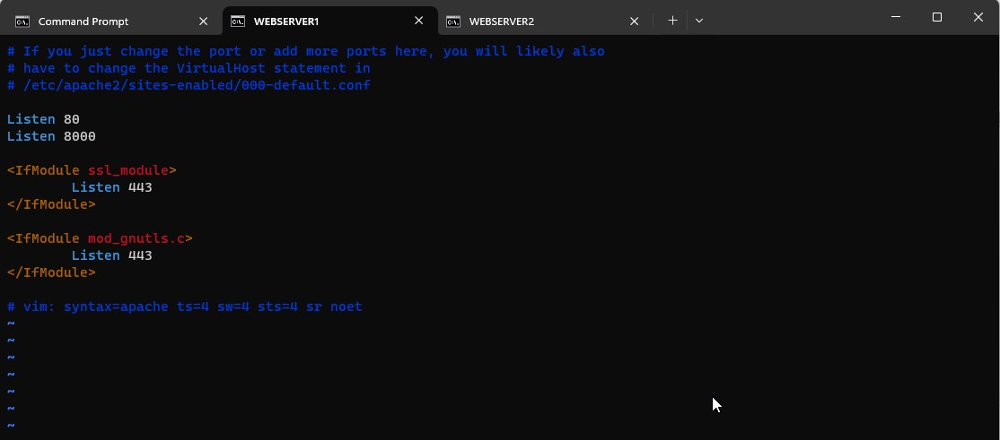

5. Run `sudo vi /etc/apache2/sites-available/000-default.conf` and change port 80 on the virtualhost to 8000

   - Run `sudo systemctl restart apache2` to restart the server

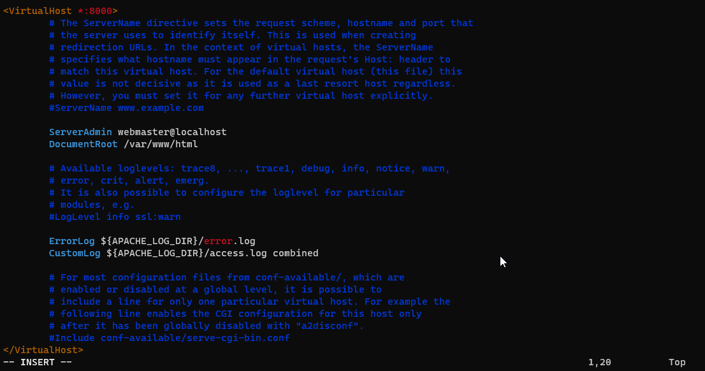

## Creating our new HTML file

1. Run `sudo vi index.html` on each webserver to open a new `index.html` file and copy the code below:

```
        <!DOCTYPE html>
        <html>
        <head>
            <title>My EC2 Instance</title>
        </head>
        <body>
            <h1>Welcome to my EC2 instance</h1>
            <p>Public IP: YOUR_PUBLIC_IP</p>
        </body>
        </html>


```


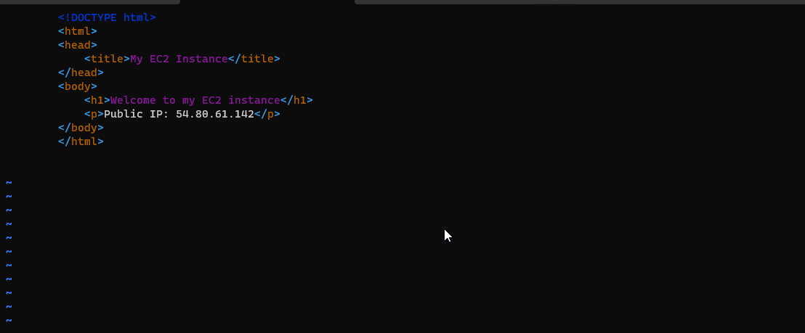

2. Run `sudo chown www-data:www-data ./index.html` to change file ownership of the `index.html` file that we created.

Now let's override the Default HMTL file of Apache:
   - Run `sudo cp -f ./index.html /var/www/html/index.html` this replaces the default file to the new file.

   - Next, `sudo systemctl restart apache2` to restart the webserver to load the new configuration.


3. Copy the Public IP address of your EC2 instances to your browser
   - webserver1 `Public IP: 204.236.242.28`
   - webserver2 `Public IP: 54.80.61.142`


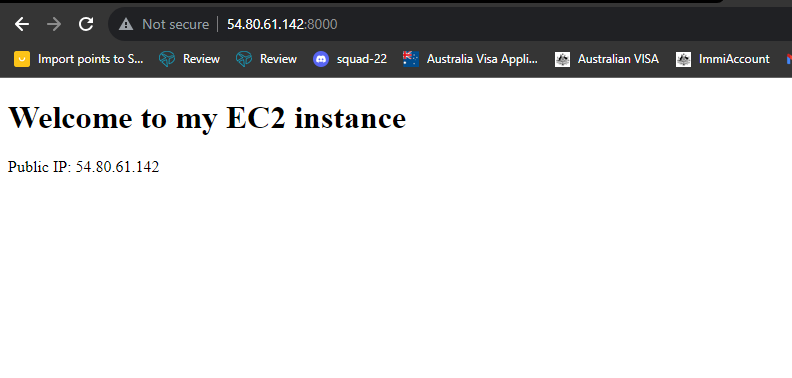

## Configuring Nginx as a Load Balancer

1. Provision a new EC2 instance and open port 80 to accept traffic from anywhere.

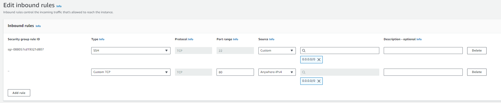

   - Run `sudo apt update -y && sudo apt install nginx -y` to install Niginx on the newly provisioned instance.


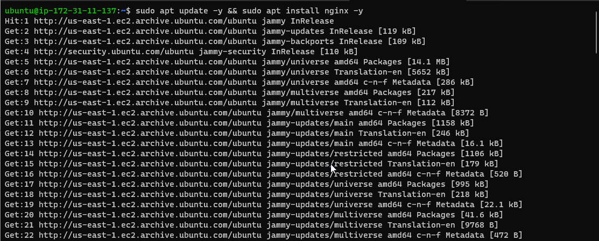

   - Run `sudo systemctl status nginx` to verify that Nginx is successfully installed.


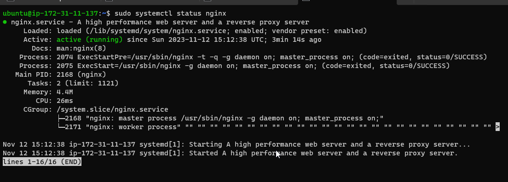

   - Run `sudo vi /etc/nginx/conf.d/loadbalancer.conf` to open the Nginx configuration file and paste the below: edit the necessary information to your own.

   ```
           
        upstream backend_servers {

            # your are to replace the public IP and Port to that of your webservers
            server 127.0.0.1:8000; # public IP and port for webserser 1
            server 127.0.0.1:8000; # public IP and port for webserver 2

        }

        server {
            listen 80;
            server_name <your load balancer's public IP addres>; # provide your load balancers public IP address

            location / {
                proxy_pass http://backend_servers;
                proxy_set_header Host $host;
                proxy_set_header X-Real-IP $remote_addr;
                proxy_set_header X-Forwarded-For $proxy_add_x_forwarded_for;
            }
        }
    

   ```

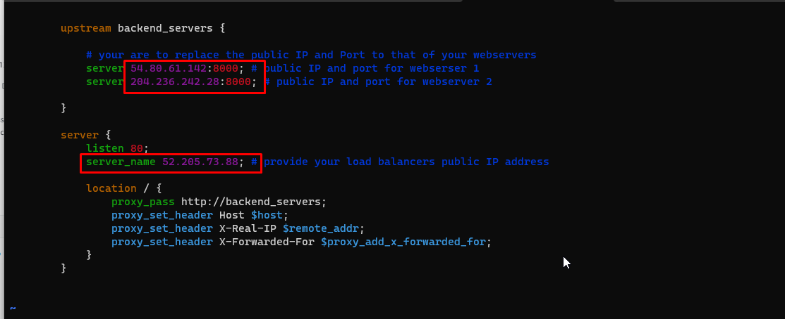

  - Run `sudo nginx -t` to test your configuration then restart to load the new configuration `sudo systemctl restart nginx`

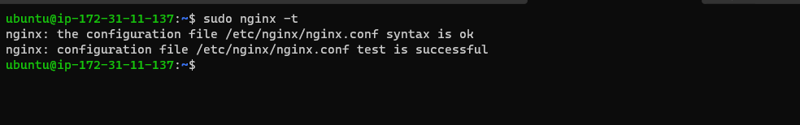

2. Lastly, paste the Public IP adress of Nginx load balancer to your browser, you should see the same webpages, but this time served by the load balancer. 

  - To test that the load balancer is working reload the browser, in doing so you will see that the `Public IP` in the html file changes which means it is different instances that requests are distributed to.

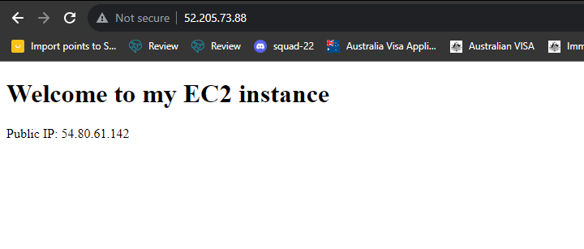

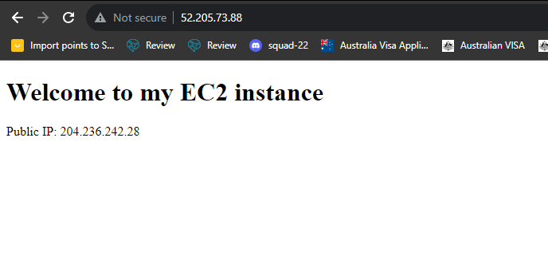

# THE END!

